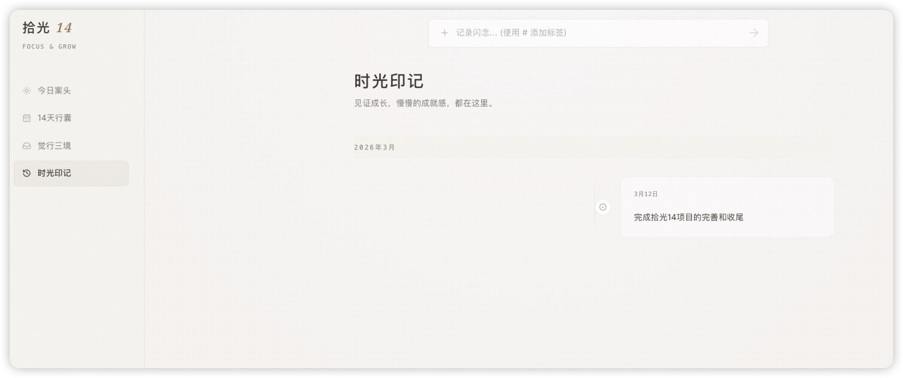
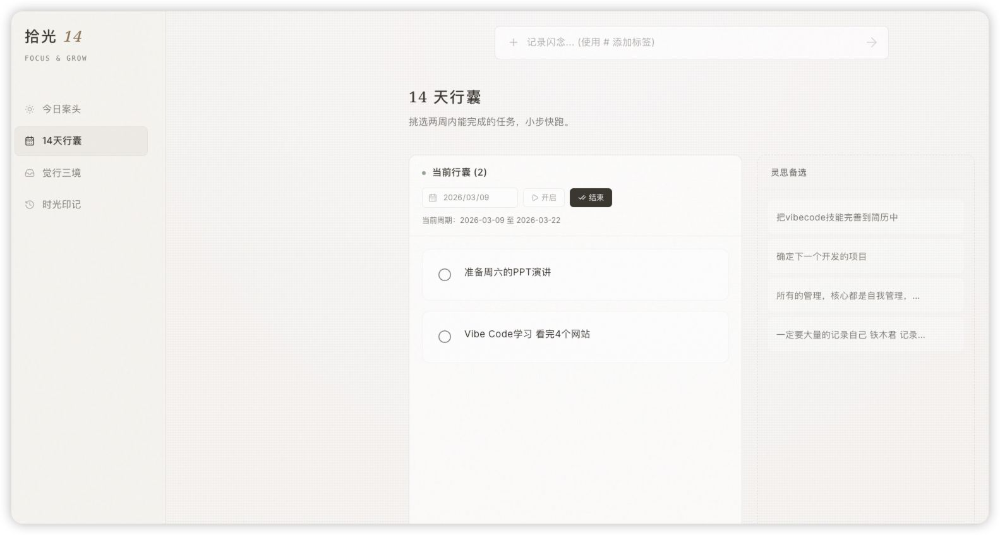
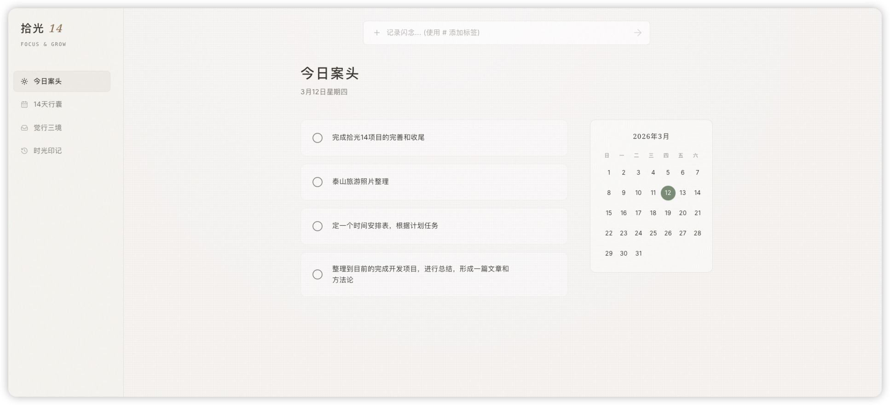
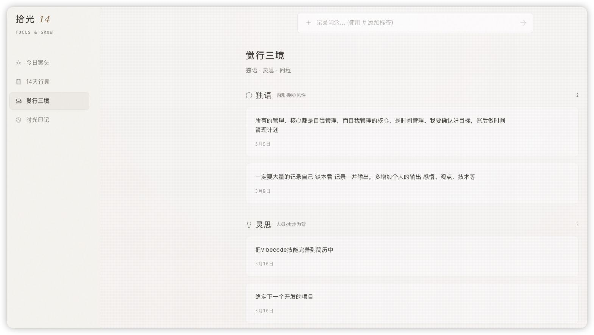

# 拾光 14 · Shiguang 14

> **Focus & Grow** —— 专注与成长
>
> 这是一个**个人成长与任务管理工具**，采用”14天”为一个周期的小步快跑模式。

---

## 产品概述

### 四大核心模块

#### 1. 📋 今日案头
- **当日待办清单**：展示今天需要完成的任务
- **日历视图**：右侧迷你日历，可查看日期分布
- **快速记录**：顶部输入框支持用 `#` 添加标签，快速记录闪念
- 支持任务完成状态切换（圆形复选框）



#### 2. 🎒 14天行囊
- **双周冲刺管理**：以14天为一个周期规划任务
- **周期控制**：显示当前周期时间范围（如 2026-03-09 至 2026-03-22）
- **任务状态**：可”开启”或”结束”一个周期
- **灵思备选**：右侧边栏收集临时想法，可随时转化为正式任务



#### 3. 🧠 觉行三境
这是一个**知识管理与反思系统**，分为三个层次：
- **独语**（内观·明心见性）：个人深度思考、感悟记录
- **灵思**（入微·步步为营）：灵感、创意、碎片化想法
- **问程**（规划与复盘）：目标追踪与定期复盘
- 每条记录带时间戳，支持分类统计数量



#### 4. ⏱️ 时光印记
- **成就时间轴**：以时间线形式展示已完成的事项
- **成长见证**：记录里程碑事件，形成可视化的成长轨迹
- 按月分组，简洁的时间轴布局



### 设计特点

| 特点 | 说明 |
|------|------|
| **极简美学** | 米白/浅灰色调，大量留白，东方禅意风格 |
| **低认知负担** | 无复杂功能堆砌，专注核心场景 |
| **中文语境** | 命名富有诗意（”拾光””行囊””觉行”），符合中文用户习惯 |
| **渐进式管理** | 从”闪念”→”备选”→”14天计划”→”今日执行”→”时光印记”形成闭环 |

### 核心价值主张

> **”挑选两周内能完成的任务，小步快跑”**

这个产品将**任务管理**、**知识沉淀**、**成长记录**三者融合，适合追求**轻量级自我管理**、喜欢**反思与记录**的个人用户，尤其是偏好**东方美学与禅意设计理念**的人群。

---

# 技术文档

面向独立创造者与终身学习者的极简成长管理应用：把”灵感收集 -> 两周聚焦 -> 今日执行 -> 周期复盘”串成一个可持续的日常闭环。
A calm personal growth app for turning scattered ideas into a consistent execution loop.

## 30 秒看懂

- 这是一个基于 Next.js 的可运行 Web 原型，前后端在同一仓库。
- 核心流程：`灵感池` -> `14 天行囊` -> `今日案头` -> `时光印记`。
- 支持登录保护（单密码或多用户固定账号）。
- 数据默认落盘到本地 JSON 文件，适合个人使用与原型验证。

## 3 分钟启动

### 1) 环境要求

- Node.js `20+`
- npm

### 2) 安装依赖

```bash
npm install
```

### 3) 初始化环境变量

```bash
cp .env.example .env.local
```

### 4) 配置登录模式（二选一，不能同时设置）

方式 A：单密码模式

```env
APP_LOGIN_PASSWORD="your_password"
```

方式 B：多用户模式

```env
APP_LOGIN_USERS="alice:123456,bob:abcdef"
```

注意：
- `APP_LOGIN_PASSWORD` 和 `APP_LOGIN_USERS` 不能同时存在。
- `APP_LOGIN_USERS` 中用户名和密码不能包含 `,` 或 `:`。

### 5) 启动项目

```bash
npm run dev
```

打开 `http://localhost:3000`，进入登录页后输入凭据即可访问。

## 核心功能

- 闪念捕手：快速录入想法，自动提取 `#标签`。
- 灵感池：管理未加工任务，可编辑、删除、推进到 14 天行囊。
- 14 天行囊：聚焦未来两周任务，可回退到灵感池或推送到今日案头。
- 今日案头：处理当日任务，完成后归档到时光印记。
- 时光印记：按时间线查看已完成任务，支持高光标记与复盘笔记。
- 目标管理：维护长期/中期/短期目标，并与执行任务建立关联。

## 常用脚本

```bash
npm run dev     # 开发模式
npm run build   # 生产构建
npm run start   # 启动生产服务
npm run clean   # 清理 Next 构建缓存
```

## 配置说明

来自 `.env.example` 的关键变量：

- `APP_LOGIN_PASSWORD`：单密码登录（必选其一）。
- `APP_LOGIN_USERS`：多用户登录（必选其一），格式 `user:pass,user2:pass2`。
- `APP_URL`：模板遗留变量，当前核心流程不依赖。
- `GEMINI_API_KEY`：模板遗留变量，当前核心流程不依赖。

## 数据与存储

项目使用文件型持久化，服务端通过 Route Handlers 写入 JSON。

单密码模式（legacy 路径）：

- `data/tasks.json`
- `data/goals.json`
- `data/focus-cycle.json`

多用户模式（按用户名隔离）：

- `data/users/<username>/tasks.json`
- `data/users/<username>/goals.json`
- `data/users/<username>/focus-cycle.json`

补充说明：
- 文件不存在时会自动创建。
- 写入采用“临时文件 + rename”以减少写坏文件风险。
- 该模型适合单用户、低并发，不适合作为高并发生产数据库方案。

## API 概览

所有接口都受登录态保护（未登录返回 `401`）。

- `GET /api/tasks`：读取任务列表。
- `PUT /api/tasks`：覆盖写入任务列表（请求体 `{"tasks": [...]}`）。
- `GET /api/goals`：读取目标列表。
- `PUT /api/goals`：覆盖写入目标列表（请求体 `{"goals": [...]}`）。
- `GET /api/focus-cycle`：读取当前聚焦周期与复盘记录。
- `PUT /api/focus-cycle`：覆盖写入聚焦周期（请求体 `{"focusCycle": {...}}`）。
- `POST /api/auth/login`：登录并写入 HttpOnly Cookie。

## Docker 部署

### 1) 构建镜像

```bash
docker build -t shiguang14:latest .
```

### 2) 运行容器（含数据持久化）

```bash
mkdir -p data

docker run -d \
  --name shiguang14 \
  -p 3000:3000 \
  -e APP_LOGIN_PASSWORD="your_password" \
  -v "$(pwd)/data:/app/data" \
  --restart unless-stopped \
  shiguang14:latest
```

如果你使用多用户模式，把 `-e APP_LOGIN_PASSWORD=...` 替换为：

```bash
-e APP_LOGIN_USERS="alice:123456,bob:abcdef"
```

容器启动后访问 `http://localhost:3000`。

## 常见问题（FAQ）

### 1) 页面返回 500，提示缺少环境变量

请检查是否设置了且仅设置了一个登录变量：
- 只设置 `APP_LOGIN_PASSWORD`，或
- 只设置 `APP_LOGIN_USERS`

### 2) 多用户模式登录失败

确认两点：
- 登录时填写了用户名和密码；
- `.env.local` 中 `APP_LOGIN_USERS` 格式为 `user:pass,user2:pass2`，且不含非法分隔符。

### 3) Docker 重启后数据丢失

确认运行容器时包含挂载参数：

```bash
-v "$(pwd)/data:/app/data"
```

### 4) 想重置本地数据

停止应用后删除数据文件：

```bash
rm -rf data/tasks.json data/goals.json data/focus-cycle.json data/users
```

下次写入时会自动重建。

## 项目结构

```text
.
├── app/
│   ├── api/
│   │   ├── auth/login/route.ts
│   │   ├── tasks/route.ts
│   │   ├── goals/route.ts
│   │   └── focus-cycle/route.ts
│   ├── login/page.tsx
│   └── page.tsx
├── components/
├── data/
├── docs/
├── lib/
├── middleware.ts
└── README.md
```

## 详细文档索引

- 产品需求：[docs/prd.md](docs/prd.md)
- UI 结构：[docs/ui.md](docs/ui.md)
- 视觉风格：[docs/style.md](docs/style.md)
- 设计与实施记录：[docs/plans](docs/plans)
